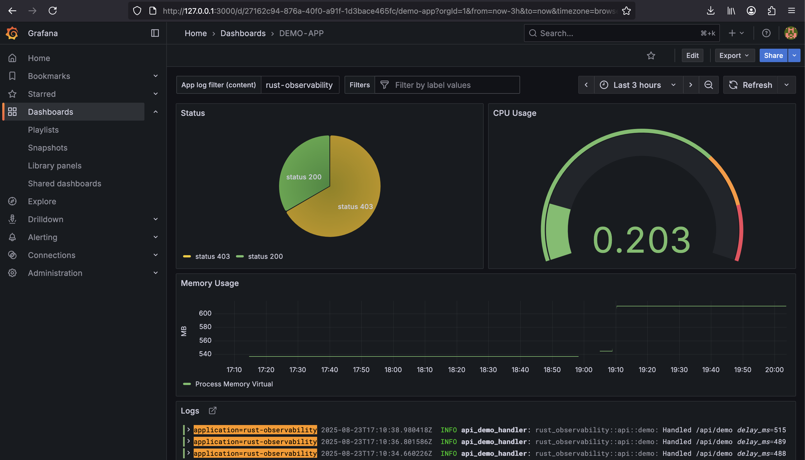
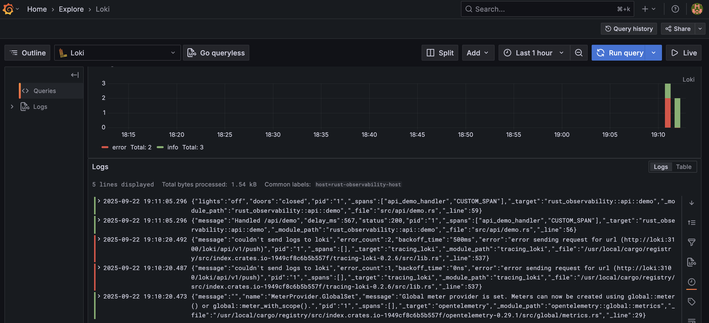
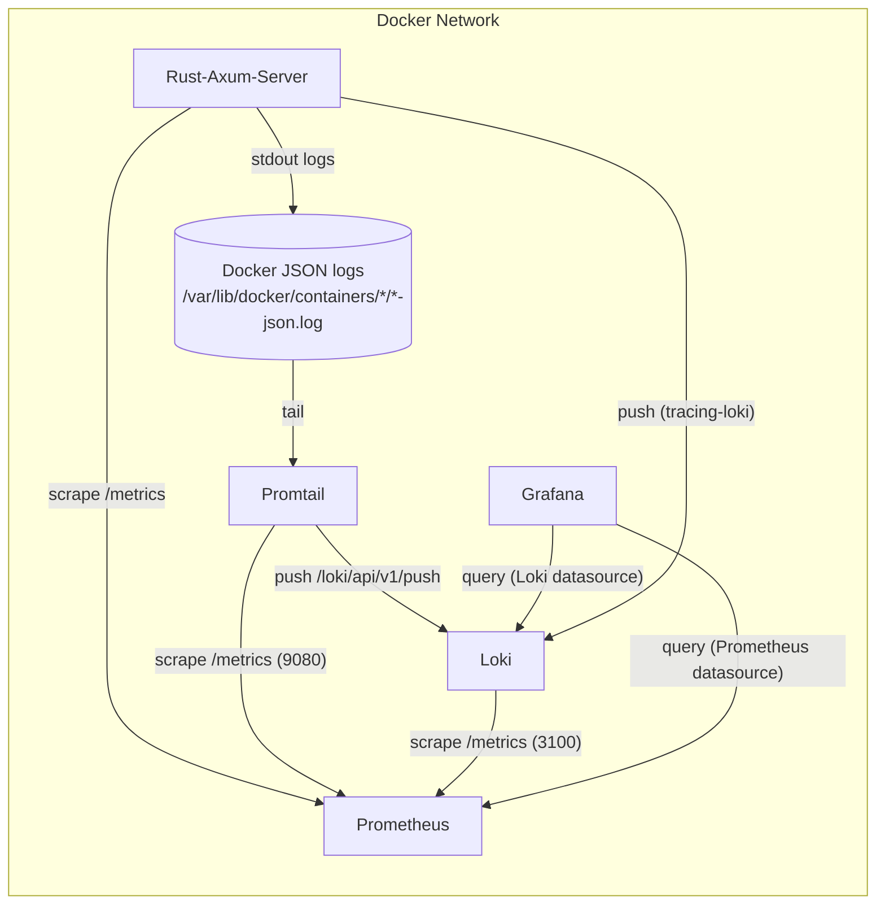

# Observability

## Introduction

A service that is not observed, is lost in the universe of distributed systems. This POC-project is a small sample to
show how keep track on your Rust Service. The Service and all the infrastructure is dockerized, you can simply start up
all with "docker-compose up"

The project demonstrates two methods of log collection:

1. Via `tracing-loki` directly from the application.

2. Via Promtail scraping Docker logs.

It also showcases a robust metrics collection system, capturing both application-level metrics (HTTP requests, handler
durations) and process-level metrics (CPU, memory).

The project uses a modern stack (Axum, Tokio, OpenTelemetry) and integrates the standard observability tools (
Prometheus, Grafana, Loki)

A small Screenshot the observed service in Grafana:



Logs:



In the logs we see on the one the custom span created by:

```rust
    let span = span!(Level::INFO, "CUSTOM_SPAN");
    let _enter = span.enter();
```

and the structured event generated by

```rust
    event!(Level::INFO, lights = "off", doors = "closed");
```

## Links

The current links available by the application:

The Rust Service:

* Hosted on port 8080: http://127.0.0.1:8080/
* API: http://127.0.0.1:8080/api/demo for generating log entries
* Metrics: http://127.0.0.1:8080/metrics for collecting the current metrics of the Rust Service
* Health: http://127.0.0.1:8080/metrics for healths status

Prometheus:

* http://127.0.0.1:9090/

Grafana:

* http://127.0.0.1:3000/

Loki:

* A simple query on Loki: http://127.0.0.1:3100/loki/api/v1/query?query={job="docker-logs"}

* A query with a range option:
    - http://127.0.0.1:3100/loki/api/v1/query_range?query={job="docker-logs"}&limit=1000&direction=backward&start=<
      rfc3339_or_unix_ns>&end=<rfc3339_or_unix_ns>

## Architecture: Logs and Metrics Flow

A little Flowchart for illustrating how the different logs are collected and transmitted to the different systems:



Notes:

- Promtail collects logs from Docker JSON log files and pushes them to Loki. Loki does not pull logs from the app. (
  Solution 1)
- Cargo tracing-loki, declare appender, push to Loki (Solution 2)
- Prometheus scrapes metrics from the app, Promtail, and Loki; logs are not stored in Prometheus.
- Grafana uses the Loki datasource for logs and the Prometheus datasource for metrics.

## Docker-Compose

Starting the application and all infrastructure components with:

```shell
docker-compose up
```