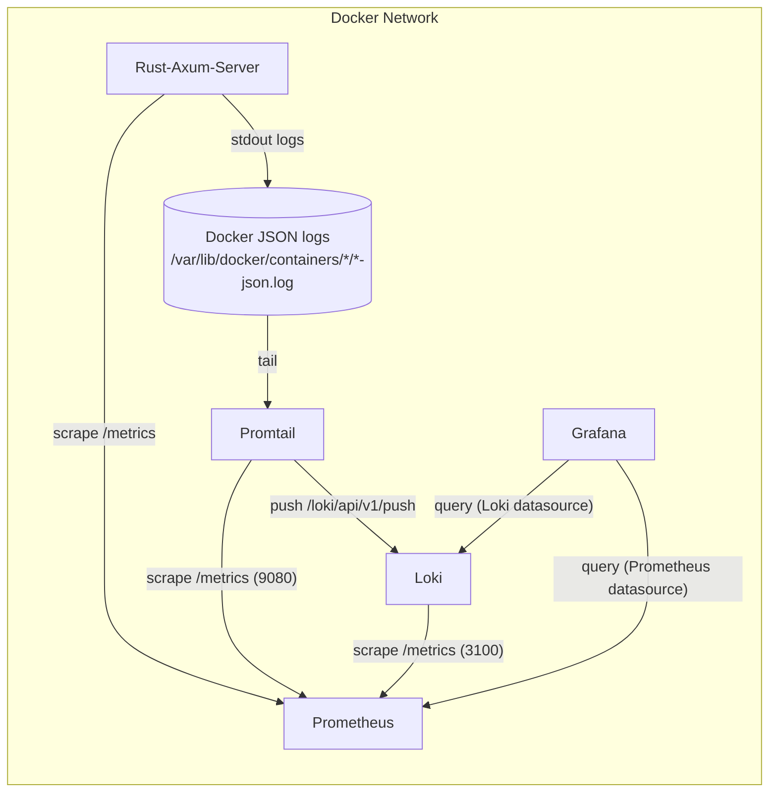

# Observability

## Links

Server: http://127.0.0.1:8080/

API: http://127.0.0.1:8080/api/demo

METRICS: http://127.0.0.1:8080/metrics

Prometheus: http://127.0.0.1:9090/

Grafana: http://127.0.0.1:3000/

See Loki API: https://grafana.com/docs/loki/latest/reference/loki-http-api/

## Logs (Loki URLs)
- Instant log query (HTTP):
  - http://127.0.0.1:3100/loki/api/v1/query?query={job="docker-logs"}
- Range log query (HTTP):
  - http://127.0.0.1:3100/loki/api/v1/query_range?query={job="docker-logs"}&limit=1000&direction=backward&start=<rfc3339_or_unix_ns>&end=<rfc3339_or_unix_ns>

## Architecture: Logs and Metrics Flow



Notes:
- Promtail collects logs from Docker JSON log files and pushes them to Loki. Loki does not pull logs from the app.
- Prometheus scrapes metrics from the app, Promtail, and Loki; logs are not stored in Prometheus.
- Grafana uses the Loki datasource for logs and the Prometheus datasource for metrics.

## Docker-Compose

```shell
docker-compose up
```